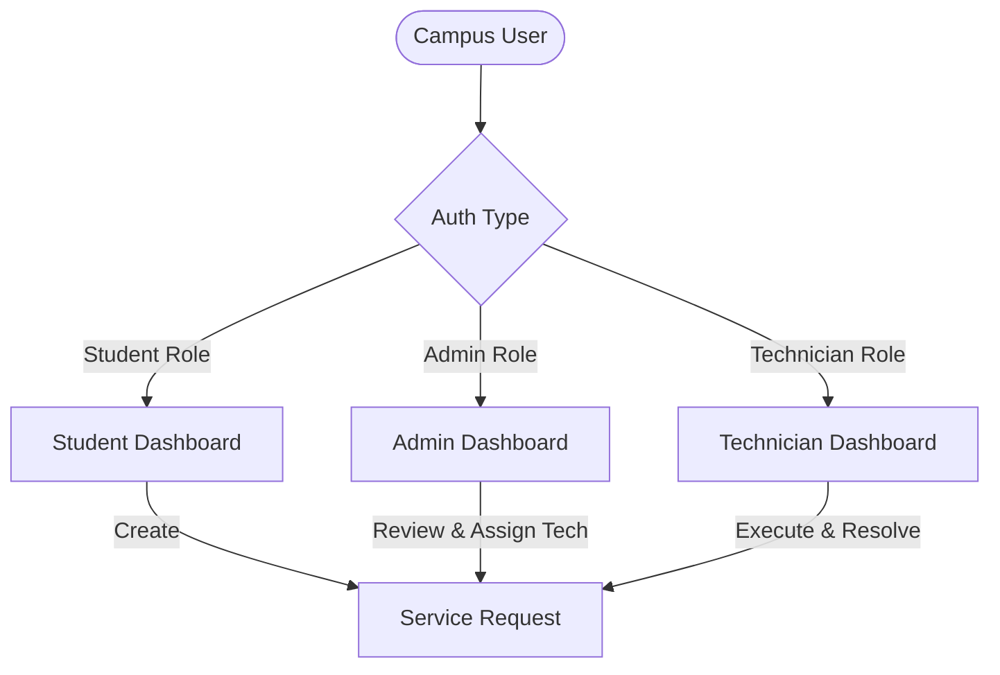
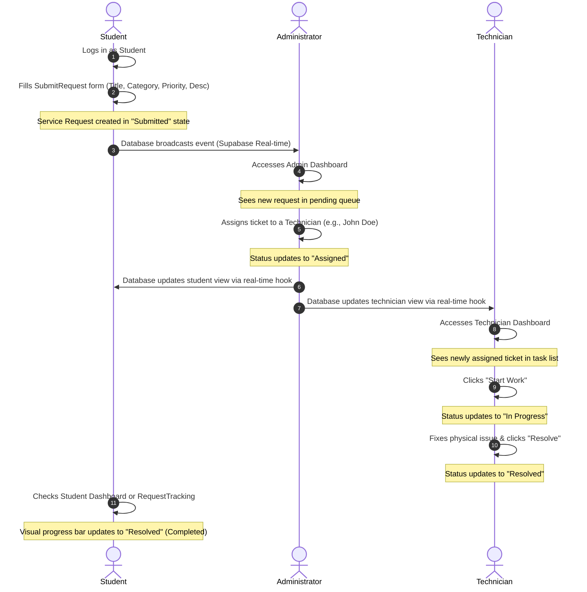

# Campus Connect (SCSMS) — Project Analysis & Audit

This document provides a comprehensive technical audit and system analysis of the **Smart Campus Service Management System (SCSMS)** codebase (referred to as **Campus Connect**).

---

## 1. Executive Summary
**Campus Connect** is a premium, real-time web application designed to streamline maintenance and service requests within a university or college campus. It connects three primary user groups — **Students**, **Administrators**, and **Technicians** — through a unified, glassmorphism-themed user interface. The system automates request submissions, tracking, technician assignment, and status updates, backed by real-time sync via Supabase.

---

## 2. Tech Stack Audit

The project uses a modern, highly-integrated frontend-as-a-service architecture:

| Category | Technology | Version | Purpose / Role in System |
| :--- | :--- | :--- | :--- |
| **Core Framework** | React | `^18.3.1` | Component-based UI logic and UI rendering. |
| **Language** | TypeScript | `^5.8.3` | Strong typing across components, API clients, and database definitions. |
| **Build System** | Vite | `^5.4.19` | Fast bundling, HMR, and build asset optimization. |
| **Router** | React Router DOM | `^6.30.1` | Client-side routing, protected routes, and query parameters. |
| **Data Layer / Backend** | Supabase | `^2.99.1` | PostgreSQL database, Authentication, Real-time web sockets, and REST API client. |
| **State Management** | TanStack React Query | `^5.83.0` | Caching, synchronization, and optimization of asynchronous database calls. |
| **Styling** | Tailwind CSS + Autoprefixer | `^3.4.17` | Utility-first CSS compiling, dark-theme styling, and responsive layout classes. |
| **Design System** | Radix UI primitives | *Various* | Accessible headless UI components (Dialog, Tabs, Dropdowns, Accordions, etc.). |
| **UI Components** | Custom shadcn/ui | *Custom* | Tailored premium components styled with Tailwind CSS. |
| **Icon Library** | Lucide React | `^0.462.0` | Clean vector iconography used throughout dashboards and timelines. |
| **Notifications** | Sonner | `^1.7.4` | Elegant, customizable toast notifications. |
| **Validation** | Zod + React Hook Form | `^3.25.76` | Type-safe form validation schemas and runtime checking. |
| **Unit Testing** | Vitest + JSDOM | `^3.2.4` | Test runner and virtual browser environment. |
| **End-to-End Testing**| Playwright | `^1.57.0` | Browser testing framework for regression prevention. |

---

## 3. Directory Structure & Architecture

Below is the directory mapping of the workspace, followed by an explanation of the layout's architectural purpose:

```text
campus-connect/
├── .env                                  # Local environment variables (Supabase URL / Anon Key)
├── components.json                       # shadcn/ui CLI configuration file
├── index.html                            # Application entry point shell
├── package.json                          # Dependencies, scripts, and build metadata
├── tsconfig.json                         # TypeScript global settings config
├── vercel.json                           # Deployment config for Vercel
├── vite.config.ts                        # Vite bundler options and path mapping alias
├── vitest.config.ts                      # Unit testing framework config
├── playwright.config.ts                  # End-to-end integration test runner config
├── public/                               # Static public assets (icons, images)
├── supabase/                             # Supabase local database configurations
│   ├── config.toml                       # Supabase CLI settings
│   └── migrations/                       # PostgreSQL schema scripts and seeds
│       ├── 20260312094143_...sql         # Initial tables (profiles, requests), RLS, triggers
│       └── 20260313142346_...sql         # Security refinement for profiles/technicians
└── src/                                  # Source Code Root
    ├── main.tsx                          # App bootstrapping, mounts react to index.html DOM
    ├── App.tsx                           # Master routing configuration and global providers
    ├── App.css                           # Legacy / fallback CSS styling
    ├── index.css                         # CSS design system (custom variables, keyframes, utilities)
    ├── vite-env.d.ts                     # Vite compiler type definitions
    ├── lib/                              # Logic layer utilities and helper modules
    │   ├── api.ts                        # API wrappers querying Supabase client
    │   ├── auth.ts                       # React context declaration for authentication
    │   └── utils.ts                      # Helper utils (e.g., tailwind merge cn utility)
    ├── hooks/                            # Custom state-sharing React hooks
    │   ├── use-mobile.tsx                # Tracks viewport width for responsive mobile menus
    │   └── use-toast.ts                  # State wrapper for shadcn toast interactions
    ├── integrations/                     # External integration setups
    │   └── supabase/
    │       ├── client.ts                 # Instantiates the Supabase client connection
    │       └── types.ts                  # Auto-generated TypeScript types matching SQL schema
    ├── components/                       # Shared reusable UI elements
    │   ├── ui/                           # Primitive components (buttons, badges, inputs, etc.)
    │   ├── AuthProvider.tsx              # Component handling auth state listener and operations
    │   ├── ProtectedRoute.tsx            # Navigation guard ensuring appropriate role routing
    │   ├── CategoryFilter.tsx            # Selection pill buttons for categories
    │   ├── SearchBar.tsx                 # Simple search text input with icons
    │   ├── StatusBadge.tsx               # Renders status with styled, semantic badge styles
    │   ├── StatusTimeline.tsx            # Shows progress indicators for maintenance stages
    │   ├── NavLink.tsx                   # Underlined links for the navbar
    │   ├── Navbar.tsx                    # Shared header navigation bar with user state controls
    │   └── RequestCard.tsx               # Summary card showing a single request for list views
    └── pages/                            # Page-level components mapped to route entry points
        ├── Index.tsx                     # Fallback placeholder router
        ├── LandingPage.tsx               # Public landing page with stats, process flowchart
        ├── LoginPage.tsx                 # Authenticating form supporting Sign In / Sign Up
        ├── StudentDashboard.tsx          # Portal for students to view, filter, track requests
        ├── SubmitRequest.tsx             # Interactive request creation form with categories
        ├── AdminDashboard.tsx            # System control center for assignments and status
        ├── TechnicianDashboard.tsx       # Minimal dashboard for viewing & resolving tickets
        ├── RequestTracking.tsx           # Full-page visual timeline showing status logs
        └── NotFound.tsx                  # 404 Route handler Page
```

### Architectural Design Patterns
1. **Client-Side Security (Route Guards):** [ProtectedRoute.tsx](file:///e:/campus-connect/src/components/ProtectedRoute.tsx) intercepts unauthorized routing. If a logged-in user lacks the required security role (e.g. Technician attempts to view `/admin`), they are redirect-routed back to the home page or login screen.
2. **Context-Driven Auth:** The [AuthProvider.tsx](file:///e:/campus-connect/src/components/AuthProvider.tsx) registers an active auth event listener (`onAuthStateChange`) directly with Supabase. It uses a small timeout delay to bypass initialization race conditions, resolving and caching the user's corresponding DB profile.
3. **Database-Type Alignment:** Types defined in [types.ts](file:///e:/campus-connect/src/integrations/supabase/types.ts) are directly bound to the database structure, removing discrepancies between front-end interfaces and query results.
4. **CSS Design Tokens:** [index.css](file:///e:/campus-connect/src/index.css) holds HSL color tokens implementing a sleek, premium dark-mode theme. It includes custom animation keyframes (`float-orb`, `pulse-glow`, `count-pulse`) and glassmorphic styling utilities (`glass-panel`, `glass-panel-strong`).

---

## 4. Stakeholders & User Roles

The system revolves around three core personas, each accessing different information:



### 1. Students (Request Creators)
*   **Context:** Students residing on campus or using university facilities.
*   **Goal:** Quickly report maintenance issues (e.g., plumbing leaks, broken furniture, network problems) and see immediate updates on who is handling them.
*   **Permissions:** Can create requests; can view only their own requests; can view profiles of technicians assigned to their tickets.

### 2. Technicians (Service Executors)
*   **Context:** University maintenance staff (plumbers, electricians, IT specialists, contractors).
*   **Goal:** View tasks explicitly assigned to them, update status as work proceeds, and mark tasks as resolved once completed.
*   **Permissions:** Can view only requests specifically assigned to them; cannot create requests or assign requests.

### 3. Administrators (Workflow Orchestrators)
*   **Context:** Campus facilities management directors or dispatchers.
*   **Goal:** Oversee all campus maintenance request queues, assign technicians based on ticket type, adjust priority levels, and track resolution metrics.
*   **Permissions:** Global view of all profiles and requests; assign/reassign technicians; override ticket statuses manually.

---

## 5. User Procedures & Workflows

### Scenario: Flow of a Maintenance Request



#### Detailed Action Items by Role:

*   **Student Procedure:**
    1.  Access portal and log in.
    2.  Click **"New Request"** (triggers `/submit-request`).
    3.  Enter title, select a category pill (e.g., Classroom, Hostel, Transport, Maintenance), describe the issue, select a priority, and submit.
    4.  The system transitions the user to their dashboard where they see the request with a **"Submitted"** badge.
    5.  Clicking the item reveals a summary panel. The student can click **"View Full Tracking"** (triggers `/track/:id`) to display a detailed visual timeline indicating who is assigned to resolve the issue.

*   **Admin Procedure:**
    1.  Log in as Admin (triggers `/admin`).
    2.  View aggregated statistics widgets (Total, Pending, Active, Resolved) summarizing the current campus load.
    3.  Use search and category pill filters to isolate specific requests.
    4.  Locate an unassigned ticket, click the **Technician dropdown**, and select a staff member (fetched from profiles matching the `Technician` role). This database update automatically sets the request status to **"Assigned"**.
    5.  Admins can also manually change the status of any request using the status dropdown.

*   **Technician Procedure:**
    1.  Log in as Technician (triggers `/technician`).
    2.  Review the task list containing only requests assigned to their profile.
    3.  For requests in the **"Assigned"** state, click **"Start Work"**, which updates the ticket status to **"In Progress"**.
    4.  For requests in the **"In Progress"** state, click **"Resolve"** once physical repairs are completed, shifting the ticket to **"Resolved"**.

---

## 6. Database Schema & Security Audit

### Database Schema Definition
The system relies on three relational tables in the public schema of a PostgreSQL instance:

```text
   profiles
  ┌───────────────┬──────────────┐
  │ id            │ UUID (PK)    │
  │ user_id       │ UUID (Unique)│──> references auth.users(id)
  │ full_name     │ TEXT         │
  │ role          │ app_role     │──> Enum ('Student', 'Admin', 'Technician')
  │ created_at    │ TIMESTAMP    │
  │ updated_at    │ TIMESTAMP    │
  └───────────────┴──────────────┘
         ▲            ▲
         │            │
         │ student_id │ technician_id (nullable)
         │            │
   service_requests   │
  ┌─────────────────┬────────────────┐
  │ id              │ UUID (PK)      │
  │ title           │ TEXT           │
  │ description     │ TEXT           │
  │ status          │ request_status │──> Enum ('Submitted', 'Assigned', 'In Progress', 'Resolved')
  │ priority        │ TEXT           │
  │ student_id      │ UUID (FK)      │──> references profiles(id)
  │ category_id     │ UUID (FK)      │─┐
  │ technician_id   │ UUID (FK, null)│ │
  │ created_at      │ TIMESTAMP      │ │
  │ updated_at      │ TIMESTAMP      │ │
  └─────────────────┴────────────────┘ │
                                       │
   categories                          │
  ┌───────────────┬──────────────┐     │
  │ id            │ UUID (PK)    │◄────┘
  │ name          │ TEXT (Unique)│
  │ created_at    │ TIMESTAMP    │
  └───────────────┴──────────────┘
```

### Database Triggers & Auth Automation
1.  **Auto-Profile Creation (`on_auth_user_created`):**
    *   To keep database profiles in sync with the primary Supabase Auth directory, a PostgreSQL function `public.handle_new_user()` is registered as a trigger after inserts on `auth.users`.
    *   It extracts the `full_name` and custom `role` from `raw_user_meta_data` (sent during sign-up) and maps it into the `public.profiles` table.
2.  **Auto-Updated At (`update_service_requests_updated_at` / `update_profiles_updated_at`):**
    *   An update trigger executes `public.update_updated_at_column()` on any modification, ensuring tracking dates reflect the last change.

### Row Level Security (RLS) Policy Audit

The database implements Row Level Security (RLS) to protect user data:

#### Table: `public.profiles`
*   **Policy: "Users can view their own profile"**
    *   `USING (auth.uid() = user_id)`
*   **Policy: "Admins and technicians can view all profiles"**
    *   `USING (has_role(auth.uid(), 'Admin') OR has_role(auth.uid(), 'Technician'))`
*   **Policy: "Students can view technician profiles for their requests"**
    *   `USING (id IN (SELECT sr.technician_id FROM service_requests sr WHERE sr.student_id IN (SELECT p.id FROM profiles p WHERE p.user_id = auth.uid()) AND sr.technician_id IS NOT NULL))`
    *   *Audit Note:* This allows students to display the full name of their assigned technician on their dashboard.
*   **Policy: "Users can update/insert their own profile"**
    *   `USING (auth.uid() = user_id)`

#### Table: `public.service_requests`
*   **Policy: "Students can create requests"**
    *   `WITH CHECK (student_id = (SELECT id FROM profiles WHERE user_id = auth.uid()))`
*   **Policy: "Admins and technicians can update requests"**
    *   `USING (has_role(auth.uid(), 'Admin') OR has_role(auth.uid(), 'Technician'))`
*   *Security Enhancement:* **Policy: "Users can view relevant requests"**
    *   `USING ((student_id = (SELECT id FROM profiles WHERE user_id = auth.uid())) OR has_role(auth.uid(), 'Admin') OR (has_role(auth.uid(), 'Technician') AND technician_id = (SELECT id FROM profiles WHERE user_id = auth.uid())))`
    *   *Audit Note:* This enforces data segregation. Students can only see their own requests. Technicians can *only* see and fetch details for requests assigned specifically to them. Admins can view all tickets globally.

---

## 7. Quality Assurance & Testing Audit

The project includes pre-configured testing setups:

1.  **Unit & Component Testing (Vitest):**
    *   Configured via [vitest.config.ts](file:///e:/campus-connect/vitest.config.ts) and using `jsdom` to mock DOM APIs in memory.
    *   Designed to test utility methods (such as dashboard summary computations in `src/lib/api.ts`) and individual UI components (like status indicators).
2.  **End-to-End Testing (Playwright):**
    *   Configured via [playwright.config.ts](file:///e:/campus-connect/playwright.config.ts) and [playwright-fixture.ts](file:///e:/campus-connect/playwright-fixture.ts).
    *   Allows automated browser scripts to simulate Student login, ticket submission, and subsequent Admin routing.

---

## 8. Strategic Recommendations & Enhancements

To further improve the application, the following enhancements are recommended:

*   **Add File Attachments (Image Uploads):**
    *   *Implementation:* Integrate a Supabase Storage bucket (`request-attachments`). Allow students to upload photos of maintenance issues during submission and display them on the tracking timeline.
*   **Technician Comments & Resolution Notes:**
    *   *Implementation:* Add a `resolution_notes` text field or a separate `comments` table. This allows technicians to explain what repairs were completed, and lets students provide additional context.
*   **Feedback & Rating System:**
    *   *Implementation:* Add a star-rating system (1 to 5) and feedback field for requests in the "Resolved" state to track service quality.
*   **Real-time Push Notifications:**
    *   *Implementation:* Connect database triggers to a notification service (using Supabase Edge Functions with a provider like Twilio, Resend, or standard Web Push APIs) to notify students when their request status changes.
